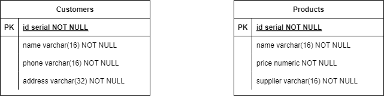

# JavaFX Form Uygulaması

## 📌 Proje Tanıtımı

JavaFX Form Uygulaması, JavaFX ve FXML teknolojilerini kullanarak PostgreSQL veritabanında **customers** ve **products** tabloları üzerinde CRUD operasyonlarını gerçekleştirmeyi amaçlayan modern bir masaüstü uygulamasıdır. Uygulama, aynı zamanda kullanıcının girdiği verilerin regex ile kontrolünü yaparak, verilerin istenilen formatta olup olmadığını denetler.

## 🏗️ Kullanılan Teknolojiler

- **JavaFX**: JavaFX (Java 21), FXML  
- **Veritabanı**: PostgreSQL  
- **Veritabanı Bağlantısı**: JDBC Driver for PostgreSQL  
- **Regex Doğrulama**: Kullanıcı inputlarının denetimi için

## ⚙️ Özellikler

### 🔹 CRUD Operasyonları
- **Müşteriler ve Ürünler:**  
  - Uygulama, customers ve products tabloları üzerinde; ekleme, okuma, güncelleme ve silme işlemlerini gerçekleştirmektedir.

### 🔹 Input Doğrulama
- **Regex Kontrolü:**  
  - Kullanıcı tarafından girilen verilerin istenilen formatla uyumlu olup olmadığı, regex kullanılarak doğrulanır.

### 🔹 Veritabanı Entegrasyonu
- **PostgreSQL ile Bağlantı:**  
  - JDBC aracılığıyla, JavaFX uygulaması ile PostgreSQL veritabanı arasında kesintisiz iletişim sağlanır.

## 📂 Veritabanı Şeması

Uygulama, aşağıda belirtilen veritabanı mimarisiyle çalışmaktadır.  

